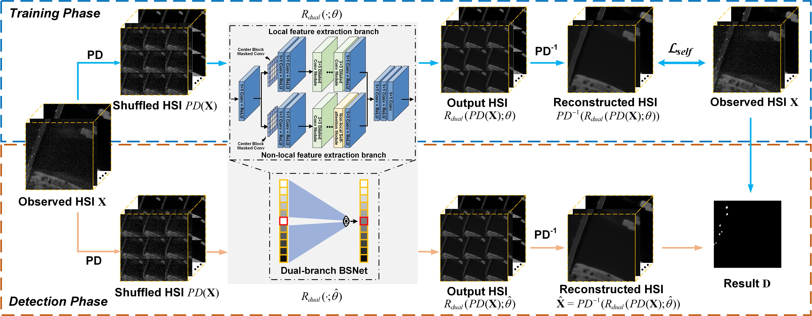

# NL2Net
This is the official repository for  ["Non-Local and Local Feature-Coupled Self-Supervised Network for Hyperspectral Anomaly Detection"](https://ieeexplore.ieee.org/document/10890991) in IEEE Journal of Selected Topics in Applied Earth Observations and Remote Sensing (JSTARS). 



## Abstract

Hyperspectral anomaly detection (HAD) aims to locate targets deviating from the background distribution in hyperspectral images (HSIs) without requiring prior knowledge. Most current deep learning-based HAD methods struggle to effectively distinguish anomalies due to limited utilization of supervision information and intrinsic non-local self-similarity in HSIs. To this end, this paper proposes a novel non-local and local feature-coupled self-supervised network (NL2Net) tailored for HAD. NL2Net employs a dual-branch architecture that integrates both local and non-local feature extraction. The local feature extraction branch (LFEB) leverages centrally masked and dilated convolutions to extract local spatial-spectral features, while the non-local feature extraction branch (NLFEB) incorporates a simplified self-attention module to capture longrange dependencies. Furthermore, an improved center block masked convolution strengthens NL2Net 's focus on surrounding background features, enhancing the background modeling effect. By reconstructing pure backgrounds and suppressing anomalous features, NL2Net achieves precise anomaly separation and superior HAD performance. Experimental results demonstrate its ability to effectively integrate multi-dimensional features and enhance HAD accuracy, surpassing state-of-the-art methods. The code will be available at https://github.com/DegangWang97.

## Setup

### Requirements

Our experiments are done with:

- Python 3.9.12
- PyTorch 1.12.1
- numpy 1.21.5
- scipy 1.7.3
- torchvision 0.13.1

## Prepare Dataset

Put the data(.mat [data, map]) into ./data

## Training and Testing

### Training
```shell
python main.py --command train --dataset HSI-II --epochs 5000 --learning_rate 1e-4 --factor 3 --gpu_ids 0
```

### Testing
```shell
python main.py --command predict --dataset HSI-II --epochs 5000 --learning_rate 1e-4 --factor 3 --gpu_ids 0
```

- If you want to Train and Test your own data, you can change the input dataset name (dataset) and tune the parameters, such as Learning rate (learning_rate), PD stride factor (factor).

## Citation

If the work or the code is helpful, please cite the paper:

```
@article{wang2025nl2net,
  author={Wang, Degang and Ren, Longfei and Sun, Xu and Gao, Lianru and Chanussot, Jocelyn}, 
  journal={IEEE J. Sel. Topics Appl. Earth Observ. Remote Sens.}, 
  title={Non-Local and Local Feature-Coupled Self-Supervised Network for Hyperspectral Anomaly Detection}, 
  year={2025},
  volume={},
  pages={},
  DOI={10.1109/JSTARS.2025.3542457}
}
```

## Acknowledgement

The codes are based on [AP-BSN](https://github.com/wooseoklee4/AP-BSN) and [SS-BSN](https://github.com/YoungJooHan/SS-BSN). Thanks for their awesome work.

## Contact
For further questions or details, please directly reach out to wangdegang20@mails.ucas.ac.cn
